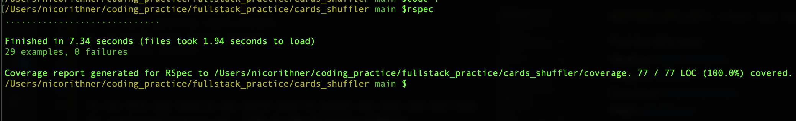

<div align="center">
  
# Cards  
## Rails/React Monolith
  


[](https://codeclimate.com/github/nicorithner/Sweater_weather/maintainability)
[](<LINK>)

  <h3>Nico Rithner - 2021</h3>
</div>

<h5  align="center">Contact Information</h5>
<p align="center">
  <a target="_blank"href="https://www.linkedin.com/in/nicorithner/"></a>&nbsp;&nbsp;&nbsp;&nbsp;
  <a href="mailto:nicorithner@gmail.com?subject=Hello%20From%20Github"></a>&nbsp;&nbsp;&nbsp;&nbsp;
</p>

## Table of Contents
- [Overview](#overview)
- [Heroku Deployment](#heroku-deployment)
- [Specifications](#specifications)
- [Installation](#installation)
- [Testing](#testing)

<hr/>

## Overview

A simple UI app that presents a visitor with an assembly of cards that contain a country each. 

Cards  include the countries flag, the capital's name in large font and a few country stats.

A visitor can see also a featured card on top - the first one in the collection by default. Clicking on a card features it.

A visitor can also find a large 'Shuffle' button in the center of the view. Clicking it shuffles the deck and displays the first card in the newly orderd list in the featured area.

A visitor can find a 'Details' link in each card at the button. Clicking it redirects to a card show page where the visitor can find more about the country.

A visitor can find at a card's show page:
  - Country Name
  - A randomly generated picture of the country
  - Same country stats as in the small card
  - Capital's current weather
  - Country's map

A visitor can click 'Home' on the navigation bar and go back to the home page or refresh it if already there.

  [back to top](#table-of-contents)
  
<hr/>

## Heroku Deployment

Visit the deployed app: [explore-countries](https://explore-countries.herokuapp.com/)

  [back to top](#table-of-contents)
  
<hr/>

## Specifications

* Ruby 3.0.0
* Rails-6.1.3.2

  [back to top](#table-of-contents)
  
<hr/>

## Installation

### Fork and Clone The Repo

Fork this Github repository: [Cards_shuffler](https://github.com/Coding-Gymnasium/Cards_shuffler)

Clone your 'Cards_shuffler' repository using SSH:
  
```
  $ git clone git@github.com:Coding-Gymnasium/Cards_shuffler.git
```

### Initial Installation

In the command line run the following commands in order:

1. `$ rails db:{create,migrate}`
2. `$ rails generate rspec:install`
3. `$ bundle exec figaro install`
4. `$ bundle install`
5. `$ yarn install`

### Set Up APIs

To run this app locally you would need to obtain api keys and add them to `config/application.yml` like in the following example:

`WEATHER_API_KEY: <Your api key goes here without quotation marks>`

#### Find the APIs here:

Weather: [Open Weather](https://openweathermap.org/guide)<br/>
Images: [Pixabay](https://pixabay.com/service/about/api/)<br/>
Countries: [Rest Countries](https://restcountries.eu/#api-endpoints-all)<br/>
Maps: [MapQuest](https://developer.mapquest.com/documentation/)

  [back to top](#table-of-contents)
  
<hr/>

## Testing

### RSpec

<p> We can check the test on the spec folder by running rspec</p>

In the command line run<br/>

`$ bundle exec rspec`

All tests should be passing.

<p align='center'>
  
</p>
  
  [back to top](#table-of-contents)
